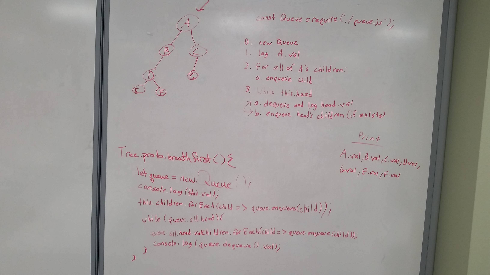

#Tree Breadth-First Traversal Code Challenge, 401 JS

This code challenge was to print out the values of each node in a tree by level, after whiteboarding the solution with a partner.

The picture of our whiteboard solution can be found below:

</img>
